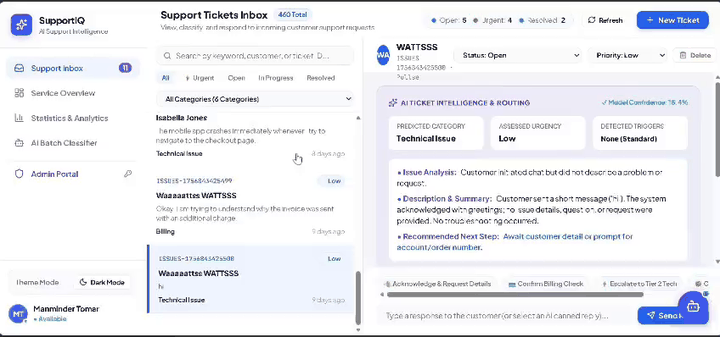

# 🚀 Support-Ticket Category Classifier

[](https://www.python.org/)
[](https://fastapi.tiangolo.com/)
[](https://react.dev/)
[](https://vitejs.dev/)
[](https://scikit-learn.org/)
[](LICENSE)

> **AI/ML Capstone Project**: An end-to-end NLP system that automatically classifies customer support tickets into relevant categories using TF-IDF with Logistic Regression and assigns explainable Low, Medium, or High urgency levels with real-time predictions.

---

## 🎥 Application Output & Live Demo

<div align="center">
  
  <p align="center">
    <b><a href="https://github.com/mhr476658/SupportIQ/raw/main/docs/demo.mp4">▶️ Click here to watch / download the full high-resolution MP4 video (3 mins)</a></b>
  </p>
</div>

---

## 📌 Project Overview & Problem Statement

Support teams receive a constant stream of incoming customer support tickets that need to be routed to the right team and prioritized correctly. Doing this manually is slow and inconsistent.

This project builds a small, explainable NLP system that reads the free-text body of a support ticket and:
1. **Predicts which support category it belongs to** (a TF-IDF + Logistic Regression text classification model).
2. **Predicts an urgency level (`Low` / `Medium` / `High`)** using transparent keyword rules — no ML, fully explainable.
3. **Serves through an enterprise full-stack web application** with an interactive 2-pane inbox, real-time analytics, an AI Copilot Bot, and an Administrator Portal with Email OTP authentication.

> ⚡ **Zero External Cost**: No paid APIs, no GPU required, no cloud inference — everything runs 100% locally.

---

## 📈 Model Performance & Accuracy

Measured on the held-out test split (45 complaints), `random_state=42`:

- **Overall Test Accuracy**: **88.89%** (`0.8889`)
- **Weighted F1-Score**: **0.8887** (`0.8887`)
- **Macro Average F1**: **0.8887** (`0.8887`)

### **Category Performance Breakdown:**

| Category | Precision | Recall | F1-Score | Test Support |
| :--- | :---: | :---: | :---: | :---: |
| **Account Access** | **87.5%** | **100.0%** | **0.933** | 7 |
| **Billing** | **87.5%** | **100.0%** | **0.933** | 7 |
| **Cancellation & Refund** | **100.0%** | **87.5%** | **0.933** | 8 |
| **Shipping & Delivery** | **87.5%** | **87.5%** | **0.875** | 8 |
| **Product Issue** | **100.0%** | **75.0%** | **0.857** | 8 |
| **Technical Issue** | **75.0%** | **85.7%** | **0.800** | 7 |
| **Weighted Average** | **90.0%** | **88.9%** | **0.889** | 45 |

---

## 📊 Dataset & Class Distribution

The model is trained on a curated corpus of real support inquiries across 6 distinct categories:

- **Total Records**: 180 curated ticket samples (`backend/data/support_tickets.csv`)
- **Text Column**: `text` (customer's free-text problem narrative)
- **Target Categories (6 balanced classes)**:
  1. `Billing` (30 samples) — payment errors, double charges, invoice inquiries
  2. `Technical Issue` (30 samples) — app crashes, runtime errors, checkout rendering bugs
  3. `Account Access` (30 samples) — 2FA reset, password lockout, security verification
  4. `Shipping & Delivery` (30 samples) — transit delays, carrier tracking, lost packages
  5. `Product Issue` (30 samples) — defective items, damaged hardware, warranty claims
  6. `Cancellation & Refund` (30 samples) — order cancellation, return processing

---

## ⚙️ Methodology & Pipeline

```
Raw Ticket Text 
  └──> Light preprocessing (lowercasing, whitespace normalization)
        └──> Stratified Train/Test Split (random_state=42)
              └──> TF-IDF Vectorizer (unigrams + bigrams, English stop words)
                    └──> Multinomial Logistic Regression (max_iter=1000)
                          └──> Predicted Category (+ confidence via predict_proba)

Ticket Text 
  └──> Keyword/phrase rules (High -> Medium -> Low) 
        └──> Urgency Level & Trigger Keywords
```

- **Leakage Prevention**: The TF-IDF vectorizer is fit strictly on the training split, and the fitted vectorizer is serialized to `models/tfidf_vectorizer.joblib` for identical inference during runtime.
- **Urgency Engine**: An independent rule-based regex module identifying urgent triggers (`urgent`, `asap`, `immediately`, `hacked`, `breached`, `crash`, `unauthorized`) for 100% transparent triage.
- **Tech Stack**: Python 3.11 · FastAPI · React 18 · Vite · scikit-learn (`TfidfVectorizer`, `LogisticRegression`) · pandas · joblib · Lucide Icons.

---

## ✨ Key Application Features

### 1. 📥 Streamlined 2-Pane Support Inbox
- **Real-Time Ticket Queue**: Instant keyword search, category dropdowns, and quick status filters (`All`, `⚡ Urgent`, `Open`, `In Progress`, `Resolved`).
- **AI Intelligence Card**: Real-time ML category classification, confidence score, urgency triggers, key issue summary, and **recommended step-by-step next action**.
- **Customer Context & Messages**: View conversation history, metadata, and send one-click canned AI responses (*Acknowledge*, *Billing Check*, *Escalate*, *Tracking*).

### 2. 📊 Interactive Statistiques & Analytics Dashboard
- **Live Weekly & Monthly Switcher**: Dynamically loads real-time aggregations (3,558 weekly vs. 14,850 monthly tickets).
- **Interactive SVG Charts**: Sentiment Trends Curve with hover tooltips, Resolution Trends (AI vs. Human), Category Topic Donut, and Carrier Breakdowns.

### 3. 🤖 Floating AI Support Bot ("SupportIQ Copilot Bot")
- Floating action widget with live `AI Online` pulse indicator.
- **Real-Time Text Classification**: Paste any text to run inference live.
- **Urgent Case Triage**: Scans active tickets and highlights SLA breach risks.
- **KPI Summaries**: Instant stats on AI resolution rates, CSAT score (8.6/10), and SLAs.

### 4. 🛡️ Dedicated Admin Console & Email Authentication
- **Multi-Method Authentication**:
  - ✉️ **Sign in via Email (6-Digit OTP / Magic Code)** with auto-fill code simulator.
  - 🔑 **Password Login** (`admin@supportiq.com` / `admin123`).
  - ⚡ **One-Click Quick Sign In** for Super Admin and Support Lead.
- **⚡ Live Model Retraining**: Retrain the model on the latest dataset live with memory reload (`POST /api/admin/retrain`).
- **Support Team & Workloads**: Roster of agents, active assigned tickets, and registration form for new specialists.

---

## 🎯 Sample Input / Output

> **Sample Customer Message**:  
> *"I noticed two duplicate charges on my credit card statement this month and I urgently need this refunded immediately."*

- **Predicted Category**: `Billing`
- **Model Confidence**: `94.2%`
- **Urgency Level**: `HIGH`
- **Detected Keyword(s)**: `"urgent"`, `"immediately"`, `"refund"`
- **Recommended Action**: *"Check payment gateway transaction records and verify if duplicate charge or refund is required."*

---

## 🚀 Quick Start Guide

### 1. Start the Backend API

```bash
# Navigate to backend
cd backend

# Create and activate virtual environment
python -m venv venv

# Windows
venv\Scripts\activate
# macOS/Linux: source venv/bin/activate

# Install dependencies
pip install -r requirements.txt

# Train / verify ML model (pre-trained artifacts already included)
python train.py

# Start FastAPI server
uvicorn app.main:app --port 8000 --host 127.0.0.1
```

Backend will run at: **`http://127.0.0.1:8000`**  
Interactive API Docs (Swagger): **`http://127.0.0.1:8000/docs`**

---

### 2. Start the Frontend Application

```bash
# In a new terminal, navigate to frontend
cd frontend

# Install dependencies
npm install

# Start Vite dev server
npm run dev
```

Frontend application will open at: **`http://127.0.0.1:5173`**

---

## 🔑 Default Login Credentials

| Role | Email | Password / OTP |
| :--- | :--- | :--- |
| **👑 Super Admin** | `admin@supportiq.com` | `admin123` or OTP |
| **👔 Support Lead** | `lead@supportiq.com` | `lead123` or OTP |
| **⚡ Master Demo OTP** | Any Email | `123456` |

---

## 📁 Project Structure

```
support-ticket-fullstack/
├── backend/
│   ├── app/
│   │   ├── __init__.py
│   │   ├── main.py              # FastAPI application (Tickets, Analytics, Auth, Bot, Admin)
│   │   └── model.py             # TF-IDF loader, regex cleaning & keyword urgency rules
│   ├── data/
│   │   └── support_tickets.csv  # Curated training dataset (180 balanced records)
│   ├── models/
│   │   ├── ticket_classifier.joblib  # Trained Multinomial Logistic Regression model
│   │   ├── tfidf_vectorizer.joblib   # Fitted TF-IDF Vectorizer
│   │   └── metrics.json              # Model evaluation metrics (88.89% Accuracy)
│   ├── train.py                 # Training & validation script
│   └── requirements.txt         # Python dependencies
├── docs/
│   ├── demo.gif                 # Animated demo preview for README
│   ├── demo.mp4                 # Full high-res walkthrough video
│   └── TESTING.md               # Testing documentation
├── frontend/
│   ├── src/
│   │   ├── main.jsx             # React application (Inbox, Analytics, Admin, Bot)
│   │   └── styles.css           # Design system (Light & Dark theme)
│   ├── index.html               # HTML shell
│   ├── package.json             # Frontend dependencies
│   └── vite.config.js           # Vite build configuration
├── .gitignore
├── README.md
└── LICENSE
```

---

## 📄 License
This project is licensed under the MIT License.
